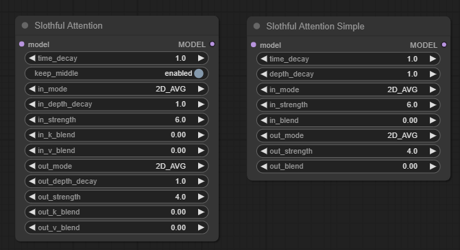

# ComfyUI Slothful Attention

This custom node allow controlling output without training.

## What's this?

This nodes allow controlling output images by reducing K and V samples on self-attentions.

The reducing method is similar to [Spatial-Reduction Attention](https://paperswithcode.com/method/spatial-reduction-attention),
but generating speed may not be increased on typical image sizes due to overheads. (In some cases, slightly slower) 

# 概要

セルフアテンションの K,V を削減することで、画像のコントロールを行います。

[Spatial-Reduction Attention](https://paperswithcode.com/method/spatial-reduction-attention) に近いですが、
速度向上やメモリ削減などの効果は期待しないでください。

手元で試した感じですと、1024x1024 程度までのサイズでは、わずかに生成速度上がったかも？程度でした。
512x512程度の場合、むしろオーバーヘッドで若干遅くなってました。

## Usage

Insert this nodes into MODEL connection before sampler. 

[sample workflow](workflow_sa.json)

Conjunction with hypernetworking and token merging May cause some problems. (These will patch attentions too) 

Tested with SD1.5, SDXL and SSD-1B based models. With LCM-lora, Lora, Controlnet or IPAdapter seems okey. 

## 使い方

サンプラーに入力するMODELの前にこのノードを差し込んでください

アテンションの Q,K,V にパッチを入れている関係で、Hypernetwork, TOME などの併用は問題出るかもしれません。

SD1.5, SDXL, SSD-1B ベースモデルで確認しています。LCM-lora, lora, Controlnet, IPAdapter などは使えてそうです。

## Parameters

### Slothful Attention

 - time_decay: Decreasing rate for step advancing.
 - keep_middle: Does not effect to middle block.

`in_...` and `out_..` parameters: individual parameters for `in` and `out` blocks

 - mode: Pooling mode for blend
 - depth_decay: Decrease rate for u-net depth
 - strength: Reduction rate (pooling_stride = strength * decay_rate)
 - k_blend: blending factor for K tensor
 - v_blend: blending factor for V tensor

note:
This nodes blend 2 tensors generated with pooling.
These are same stride but size is 1 or same to stride.

When k_blend is 0, K is just pooled tensor with size=1.

### Slothful Attention Simple

Same to Slothful Attention, but following paramters are combined.

 - keep_middle: True
 - in_depth_decay: depth_decay
 - in_k_blend: in_blend
 - in_v_blend: in_blend
 - out_depth_decay: depth_decay
 - out_k_blend: out_blend
 - out_v_blend: out_blend

## パラメータ

### Slothful Attention

 - time_decay: ステップが進むごとに効果を弱める係数です
 - keep_middle: Trueのとき、middleブロックには適用しません
 
`in_...` `out_..` パラメータ: inブロック, outブロックに別のパラメータを適用できます

 - mode: プーリングモード
 - depth_decay: u-netの層が深くなるごとに効果を弱める係数です
 - strength: サンプル削減の比率 (pooling_stride = strength * decay_rate)
 - k_blend: K 生成時の ブレンド比率
 - v_blend: V 生成時の ブレンド比率

K, V 削減時、プーリングで２つのテンソルを作成して、blendパラメータに応じてブレンドします

プーリングのstrideは両方同じですが、sizeについては 片方が 1 で もう片方が siride と同じです

ブレント比率は size=stride で生成したテンソルの比率ですので、
blend=0 の時は size=1 のプーリングで生成したテンソルをそのまま利用します

### Slothful Attention Simple

Slothful Attention とおおまか同じです。以下の対応でパラメータが設定されます。

 - keep_middle: True
 - in_depth_decay: depth_decay
 - in_k_blend: in_blend
 - in_v_blend: in_blend
 - out_depth_decay: depth_decay
 - out_k_blend: out_blend
 - out_v_blend: out_blend

パラメータ数多いと正直使いづらいので、慣れるまでは Simple 側のノードで良いか

## Output sample

Belows are generated on same parameter, except sloth attention.

### SSD-1b based model with lcm-lora

 - checkoint: [ssd-1b-animagine](https://huggingface.co/furusu/SSD-1B-anime)
 - lcm-lora: [lcm-animagine](https://huggingface.co/furusu/SD-LoRA/blob/main/lcm-animagine.safetensors)

| Without | With Slothful Attention |
|----|----|
|  |  |

more sample images: [pooling_modes.md](pooling_modes.md)

